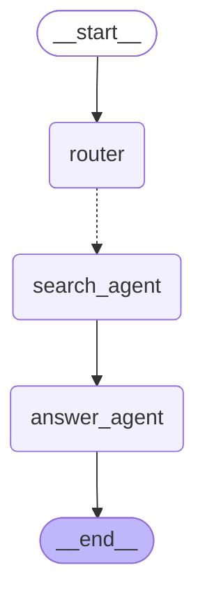

# LangGraph 구조 확인 방법

## 방법 1: 온라인 Mermaid 에디터 (추천 ⭐)

1. 아래 링크를 브라우저에서 열기:
   **https://mermaid.live/**

2. 왼쪽 에디터에 아래 코드를 붙여넣기:



3. 오른쪽에서 실시간으로 다이어그램 확인!
4. PNG/SVG로 다운로드 가능 (Export 버튼)

---

## 방법 2: 탐색기에서 HTML 열기

1. Windows 탐색기에서 파일 위치로 이동:
   ```
   d:\APP\ispl3\backend\test\graph_visualization.html
   ```

2. 파일을 **오른쪽 클릭** → **연결 프로그램** → **Chrome** 또는 **Edge** 선택

---

## 방법 3: 명령줄에서 브라우저 열기

PowerShell에서 실행:
```powershell
Start-Process "d:\APP\ispl3\backend\test\graph_visualization.html"
```

---

## 📊 그래프 구조 (텍스트 버전)

```
     [시작]
        ↓
   ┌─────────┐
   │ Router  │ ← 의도 분류 (search/upload/manage)
   └─────────┘
        ↓ (점선: Command)
   ┌─────────┐
   │ Search  │ ← 벡터 검색 (pgvector + OpenAI)
   └─────────┘
        ↓
   ┌─────────┐
   │ Answer  │ ← GPT-4 답변 생성
   └─────────┘
        ↓
     [종료]
```

### 노드 설명:
- **__start__**: 그래프 진입점
- **router**: 사용자 질의 의도 분류
- **search_agent**: 벡터 검색 수행
- **answer_agent**: 최종 답변 생성
- **__end__**: 그래프 종료

### 엣지 설명:
- **실선 (→)**: 순차 실행
- **점선 (-.->)**: Command로 동적 라우팅

---

## 🎨 컬러 의미

- **투명 (first)**: 시작 노드
- **보라색 (last)**: 종료 노드  
- **연보라색 (default)**: 일반 Agent 노드

---

## 상세 정보

전체 구조 설명은 `graph_simple_text.txt` 파일 참조

